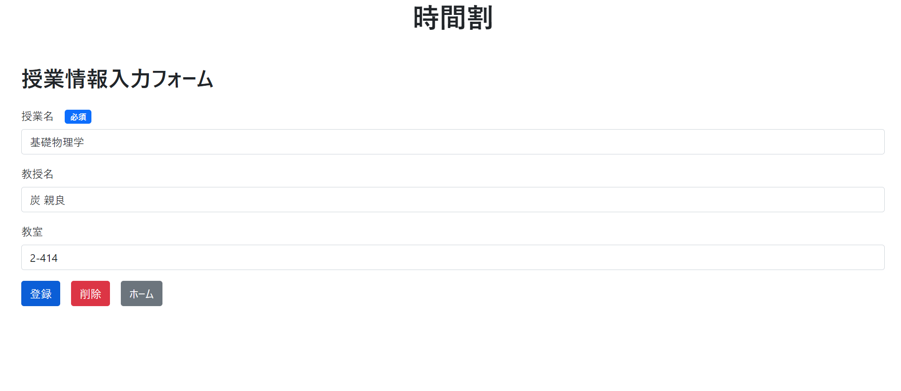

<br>

# 時間割登録アプリ

このアプリケーションを使って、時間割を登録することができます。
<br>
 

<br>

## 機能

1. **授業の登録**: 月曜日から金曜日まで、1限から6限までの授業を登録できます。それぞれの授業で、授業名、教授名、教室を登録します。

2. **登録内容の修正**: 登録した時間割は、何度でも修正可能です。

3. **データの一括削除**: 一度に登録したすべての授業情報を削除できます。

<br>

## 使用方法

1. 登録したい授業のセルをクリックします。

<br>

2. 授業情報入力フォームにて、授業情報を入力します。授業名は必須ですが、教授名、教室は任意項目となっています。入力後、登録ボタンをクリックします。


3. ホーム画面で登録した情報を確認できます。


4. 修正したい場合、修正したい授業のセルをクリックし、情報を修正して登録し直せます。

<br>

5.  一括削除をしたい場合、全てのデータを削除ボタンをクリックし、確認モーダルにて、はいをクリックします。


<br>

## 技術的な詳細

- **フロントエンド**: HTML, JavaScript, Vue.js

- **バックエンド**: PythonのFlask

- **デザイン**: CSSとBootstrap

- **環境構築**: Docker

<br>

## 開発者

* 大池 樹 (Tatsuki Oike) / プロジェクトマネージャー
* 二木 豪 (Go Futaki) / フロントエンド
* 及川 浩太朗 (Kotaro Oikawa) / バックエンド
* 伊郷 桃華 (Momoka Igo) / デザイン


<br><br><br>


<!-- # Git

```sh
git clone https://github.com/sophia-frontend-backend/timetable.git
```

```sh
git add .
git commit -m "メッセージ"
git push
```

```sh
git pull
``` -->

<!-- # frontend

```sh
cd frontend
# npm install
npm run dev
ctrl+C
cd ..
``` -->
# 1 Gitのセッティング

## 1.1 初めてセッティングする場合

```sh
git init
git add .
git commit -m "first commit"
git branch -M main
git remote add origin https://github.com/frontend-develop-sophia/sample.git
git push -u origin main
```

## 1.2 初めてプロジェクトコードをダウンロードする場合

```sh
git clone https://github.com/frontend-develop-sophia/sample.git
cd ./sample
```

## 1.3 変更を更新して、pushする場合

```sh
git add .
git commit -m "message"
git push -u origin main
```

## 1.4 誰かの変更(リポジトリ)をもってくる場合

```sh
git pull
```

<br>

# 2 Vite proj

```sh
cd ./project
npm init vite-app frontend
cd frontend
npm install
npm install url parseurl
npm install router
npm install vuex
npm install axios
```
```sh
npm run dev
npm run build
```

<br>

# 3 ブランチ


## 3.1 ブランチの作り方

```sh
git branch <branch名>
※まだブランチを作成しただけで切り替えられていない

git branch
※ブランチの一覧を表示
※*がついてるのが今いるブランチ
```

## 3.2 ブランチの切り替えかた

```sh
git checkout <branch名>
※既存のブランチに切り替える

git checkout -b <brach名>
※新規ブランチを作成し，切り替えも行う
```

## 3.3 ブランチのマージの仕方

```sh
git merge <branch名>
※自身がいるブランチに"ブランチ名"をマージすることができる
```

## 3.4 ブランチの削除の仕方

```sh
git branch -d ブランチ名
```
