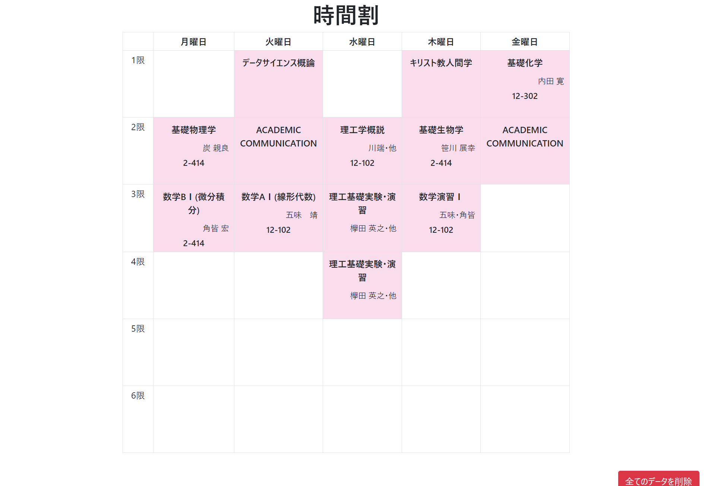
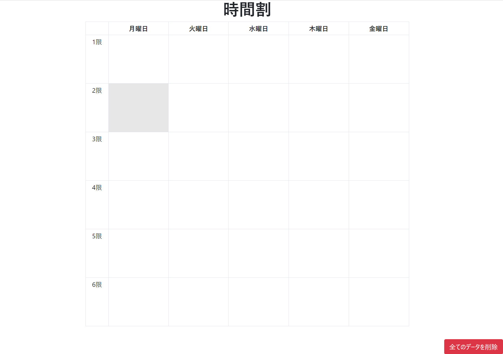
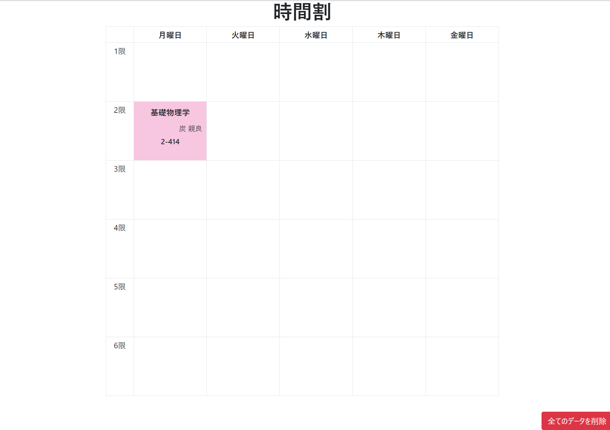
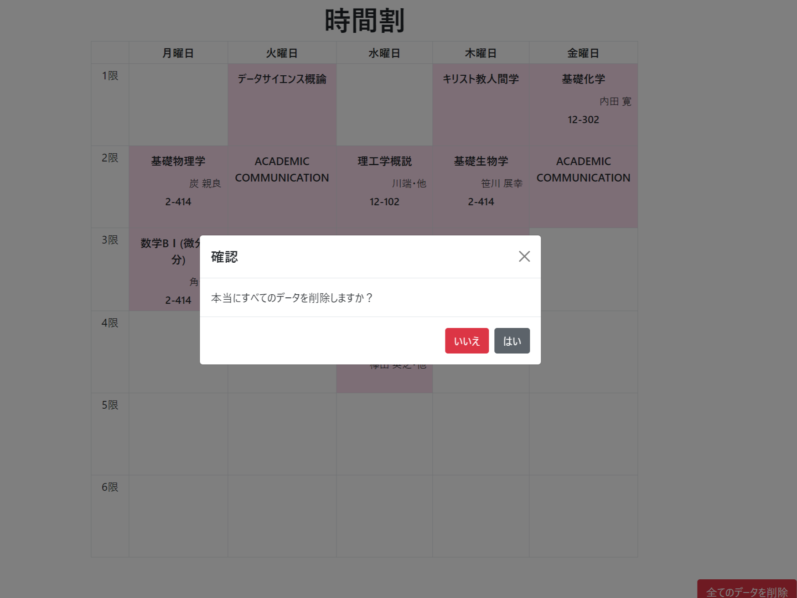

 

# 時間割登録アプリ

このアプリケーションを使って、時間割を登録することができます。
 
 

 

## 機能

1. **授業の登録**: 月曜日から金曜日まで、1限から6限までの授業を登録できます。それぞれの授業で、授業名、教授名、教室を登録します。

2. **登録内容の修正**: 登録した時間割は、何度でも修正可能です。

3. **データの一括削除**: 一度に登録したすべての授業情報を削除できます。

 

## 使用方法

1. 登録したい授業のセルをクリックします。

 

2. 授業情報入力フォームにて、授業情報を入力します。授業名は必須ですが、教授名、教室は任意項目となっています。入力後、登録ボタンをクリックします。

3. ホーム画面で登録した情報を確認できます。

4. 修正したい場合、修正したい授業のセルをクリックし、情報を修正して登録し直せます。

 

5.  一括削除をしたい場合、全てのデータを削除ボタンをクリックし、確認モーダルにて、はいをクリックします。

 

## 技術的な詳細

- **フロントエンド**: HTML, JavaScript, Vue.js

- **バックエンド**: PythonのFlask

- **デザイン**: CSSとBootstrap

- **環境構築**: Docker

 

## 開発者

* 大池 樹 (Tatsuki Oike) / プロジェクトマネージャー
* 二木 豪 (Go Futaki) / フロントエンド
* 及川 浩太朗 (Kotaro Oikawa) / バックエンド
* 伊郷 桃華 (Momoka Igo) / デザイン

   
